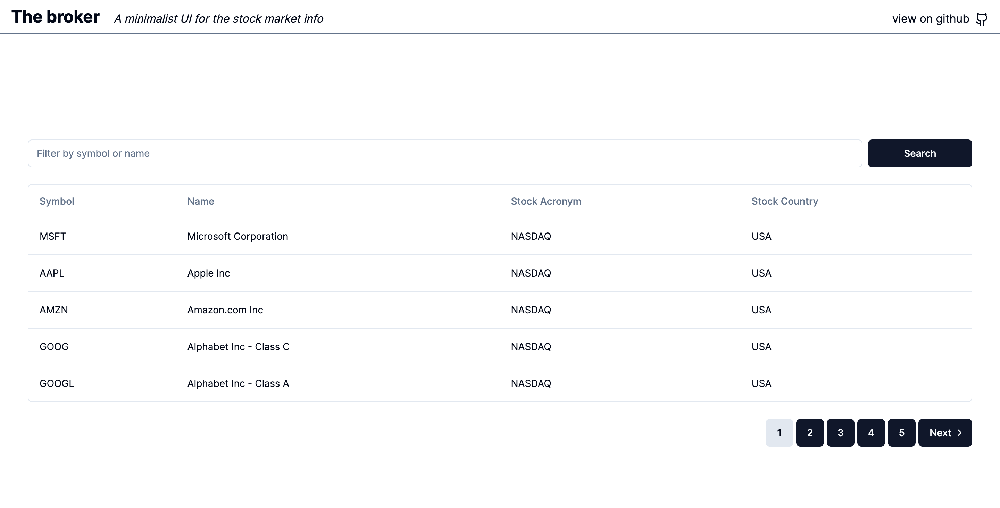
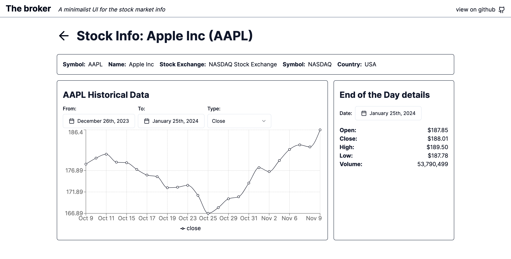

# The Broker

A minimalist UI for the stock market info

## Motivation

This app was made out of a code challenge, a home assignment, and I liked enough to make it OSS and use it as a demo for my personal portfolio.

This Web app is made with [NextJs](https://nextjs.org/), and [shadcn-ui](https://ui.shadcn.com/), one of the hot UI libraries for React these days (2024).

## Getting Started

The App works with the [Marketstack](https://marketstack.com/) API, you can read the documentation
[here](https://marketstack.com/documentation), and in order to fetch data you need to singup to get an API KEY [here](https://marketstack.com/signup).

If you don't have yet a Marketstack account, and want to play around with a live demo of the app, you can visit [https://thebroker.vercel.app/](https://thebroker.vercel.app/).
Have in mind that this live demo only contains some data for the following tokens: (MSFT, AAPL) and the date ranges from June 2023 to Jan 2024.

After creating your account, you can do an API request in the form of

```
https://api.marketstack.com/v1/eod
    ? access_key = YOUR_ACCESS_KEY
    & symbols = AAPL
```

So, in order to show some data in the Web App, you need to configure [Marketstack](https://marketstack.com/) keys in an `.env` file:

First, create an `.env` file in your project directory, and add the following variables:

```
# .env file
# Marketstack API keys
API_URL="http://api.marketstack.com/v1"
API_KEY="<YOUR_ACCESS_KEY>"

# The Page default size
API_REQUEST_LIMIT=50
```

Variables `API_URL` and `API_KEY` are the ones that will let you to fetch data from Marketstack.

The variable `API_REQUEST_LIMIT` will determine the size of the page (the number of rows) that will be fetch and displayed on every request. The minimal value es 1, and the max is 100.

Second, run the development server:

```bash
npm run dev
# or
yarn dev
# or
pnpm dev
# or
bun dev
```

Open [http://localhost:3000](http://localhost:3000) with your browser to see the result.

## Screens

### Index

Here you can view all stock items with some pagination, you can filter also by name or symbol



### Symbol detail

Here you can view the End of the day data, and some historical data in a chart. You can view data from a date range.


